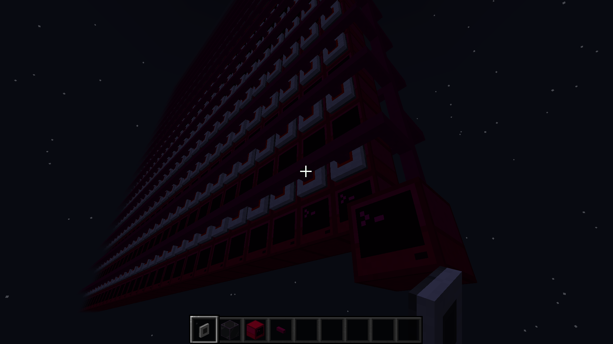

# Cluster Usage

# Wake On LAN: [WakeOnLAN.mp4](./WakeOnLAN.mp4)
# Provisioning a Node: [NodeProvisioning.mp4](./NodeProvisioning.mp4)
# WorldEdit
```py
Build Cluster

//pos1 1,1,1
//pos2 320,240,1
//set computercraft:computer_command

Build Modem and Cables (front side)

//pos1 1,1,0
//pos2 1,2,0
//copy

//pos1 1,1,0
//pos2 320,240,0
//set #clipboard

Build Modem and Cables (back side)

//pos1 1,1,2
//pos2 1,2,2
//copy

//pos1 1,1,2
//pos2 320,240,2
//set #clipboard@[0,-1,0]

Build Interconnect between Switches

Add Command Node and Disk Drive

Insert Disk into Disk Drive

Boot Command Node and Edit Scripts

Provision Nodes and Wake On LAN

Group Select and Call Remote
```
